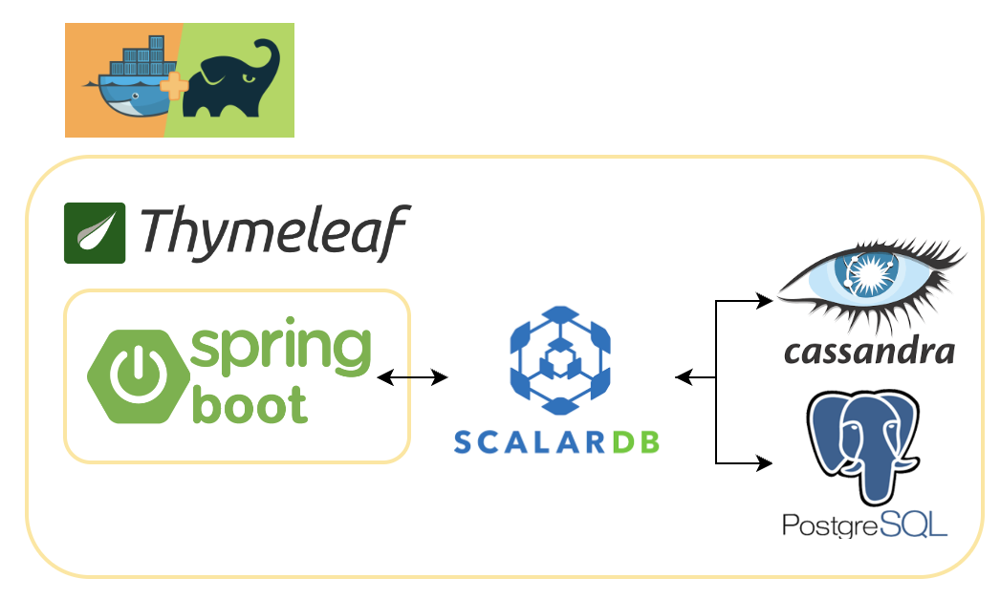

# Lab Search Pro
## Prerequisites
- JAVA
- Gradle
- Docker, Docker Compose
- RDBMS
- Cassandra
- Spring Boot
- Thymeleaf

## Application
### Overview
Lab Search Pro manages transactions between Cassandra (NoSQL) and RDBMS (SQL) using Scalar DB. The GUI is managed with Spring Boot and Thymeleaf. Additionally, these packages are integrally managed using Gradle and Docker.
For RDBMS, we utilized SQlite.



### Schema
All the tables belong to either 'public' or 'resources' namespaces

## Configuration
Configurations for Lab Search Por are as follows:
```bash
scalar.db.storage=multi-storage
scalar.db.multi_storage.storages=sqlite,cassandra
scalar.db.multi_storage.storages.sqlite.storage=jdbc
scalar.db.multi_storage.storages.sqlite.contact_points=jdbc:sqlite:src/main/resources/static/test1.sqlite3
scalar.db.multi_storage.storages.sqlite.username=user
scalar.db.multi_storage.storages.sqlite.password=password
scalar.db.multi_storage.storages.cassandra.storage=cassandra
scalar.db.multi_storage.storages.cassandra.contact_points=backend-cassandra
scalar.db.multi_storage.storages.cassandra.username=cassandra
scalar.db.multi_storage.storages.cassandra.password=cassandra
scalar.db.multi_storage.namespace_mapping=public:sqlite,resource:cassandra

scalar.db.multi_storage.default_storage=sqlite
```

## Setup
1. Just by running the command bellow, your GUI would be ready.
```bash
  docker compose up --build
```

2. Once the log beneath is shown, access to [http://localhost:8090/api/](http://localhost:8090/api/)
```bash
java  | 2023-07-19T16:51:56.304Z  INFO 285 --- [main] com.todo Todo : Started Todo in ~
```

## Clean Up
To stop Cassandra, MySQL and Spring Boot, run the command below.
```bash
docker compose down
```
